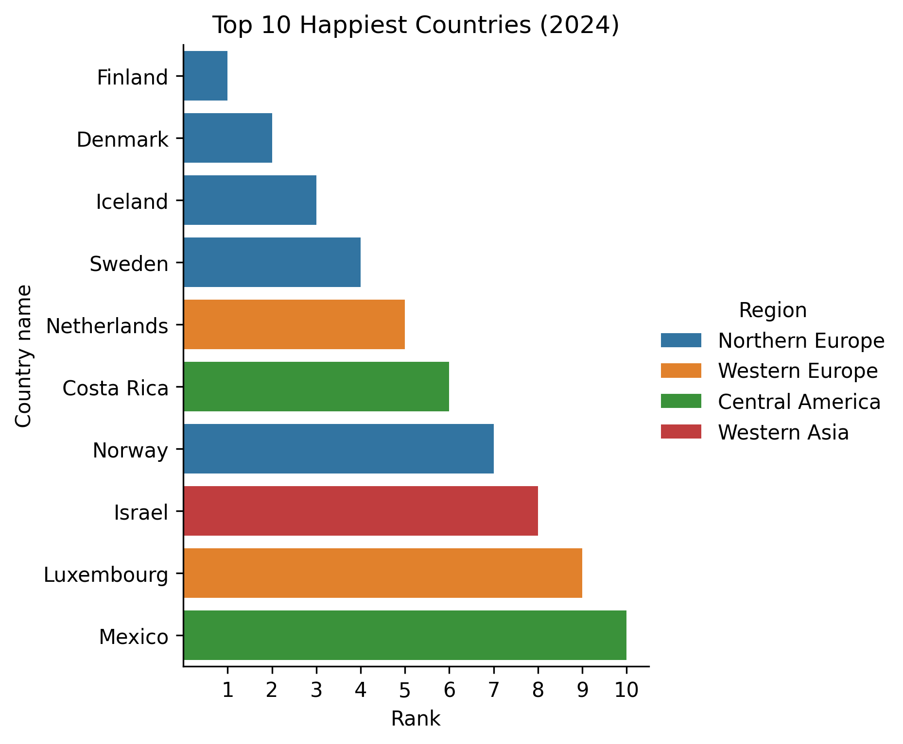
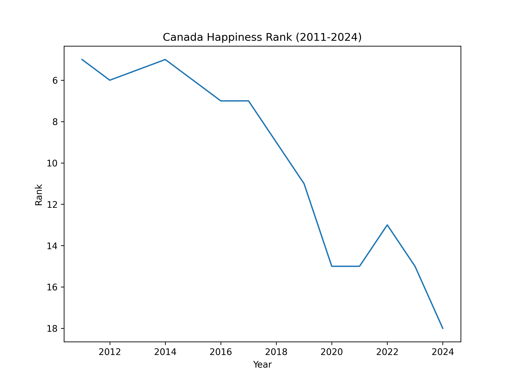

# 🌍 World Happiness Report – Exploratory Data Analysis (EDA)

This project analyzes the **World Happiness Report dataset (2011–2024)** to explore global happiness trends and the socio-economic factors that drive them. Using Python (Pandas, Matplotlib, Seaborn), I visualized happiness rankings, trends over time, and correlations between key explanatory variables such as **GDP per capita, social support, life expectancy, and perceptions of corruption**.  

---

## 🔎 Key Insights
- **Top 10 happiest countries in 2024** are dominated by **Northern and Western Europe**, but also include **Costa Rica, Israel, and Mexico**.  
- **Canada’s happiness rank has declined steadily** since 2011 (from top 5 to outside top 15 in 2024).  
- **Social support and GDP per capita** show the strongest positive correlations with happiness (Ladder Score).  
- The **Dystopia + residual** term captures unexplained variation, highlighting that subjective well-being is not fully explained by measurable socio-economic factors.  

---

## 📊 Visualizations
- 📈 **Rank Trends (2011–2024):** Top 10 happiest countries compared over time, with Canada highlighted.  
- 📊 **Stacked Bar Analysis:** Breakdown of how GDP, social support, life expectancy, freedom, generosity, and corruption contribute to overall happiness.  
- 🗺 **Regional Comparisons:** Horizontal bar charts color-coded by region.  
- 🔗 **Pairwise Correlation Matrix:** Scatterplot grid showing relationships between all explanatory factors and happiness.  

---

## 🖼️ Sample Visuals

 

---

## 🛠 Tools & Libraries
- **Python 3.11**  
- **Pandas / NumPy** – data cleaning and transformation  
- **Matplotlib / Seaborn** – visualizations  
- **Jupyter Notebook** – interactive analysis  
- **Power BI** – interactive dashboards

---

## 🚀 Why This Project Matters
This project demonstrates:  
- **Exploratory Data Analysis (EDA):** turning raw data into insights.  
- **Data Visualization:** creating clear, professional charts for non-technical audiences.  
- **Analytical Storytelling:** connecting data with real-world insights about global well-being.  

Such skills are directly relevant for **Data Analyst, Business Analyst, and Financial Analyst** roles where data needs to be cleaned, visualized, and explained to stakeholders.  

---

## 📊 Power BI Dashboard
Alongside the Python analysis, I built an **interactive Power BI dashboard** to explore the data more dynamically.  

### Dashboard Features:
- 🌍 **Map View** – Happiness scores across countries and regions.  
- 📊 **Top 10 Countries (2011–2024)** – With slicers to adjust ranking thresholds.  
- 📈 **Trend Lines** – Happiness rank changes for top countries over time.  
- 🟦 **Factor Contributions** – Stacked bars showing how GDP, social support, life expectancy, freedom, etc. contribute to the overall Ladder score.  

### Previews:
  
  
  

---

## 📂 Project Structure
