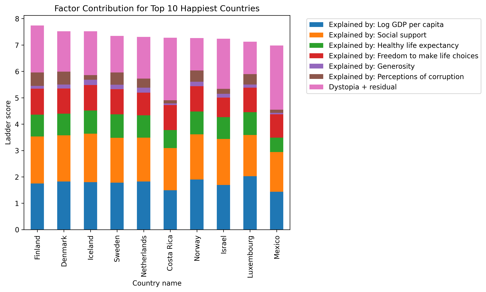

# World Happiness Report — Exploratory Data Analysis (2011–2024)

This project explores global happiness trends using Gallup World Poll data.  
The goal is to understand **which factors drive happiness**, **how countries' rankings evolve over time**,  
and **which countries over- or under-perform compared to expectations**.

---

## 📊 Key Questions
- Who are the happiest and least happy countries in 2024?
- How have rankings changed over 2011–2024 (e.g., Canada’s decline, Nordic stability)?
- Which factors (GDP, social support, life expectancy, freedom, corruption, generosity) matter most?
- Which countries are happier or less happy than predicted by their fundamentals?

---

## 🔍 Methods & Tools
- **Python (Pandas, Matplotlib, Seaborn)**
- Data cleaning (handling NaN, filtering years, merging datasets)
- Exploratory Data Analysis (EDA)
- Correlation, residuals, and factor decomposition
- Visualizations: bar charts, line charts, stacked bars, scatter plots, heatmaps

---

## 📈 Key Insights
- Nordic countries consistently dominate the top rankings.
- Canada dropped from top 10 in 2011–2018 to rank 18 in 2024.
- Social support, GDP per capita, and life expectancy are the strongest happiness drivers.
- Generosity has little explanatory power in recent years.
- Some countries (e.g., Costa Rica) are happier than predicted by fundamentals, while others underperform.

---

## 🖼️ Sample Visuals

---

## 📂 Project Structure
